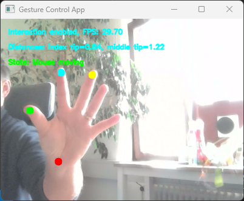

# Gesture Control

Full featured mouse control with less than 300 LoCs using the mediapipe library.

## Installation 
Install python > 3.10 and the dependencies from _requirements.txt_.
You may start the app with _python gesture_control.py_ in your environment.

## Configuration
Have a look at _config.sample.json_ which should be self explanatory.
Afterwards call _python gesture_control.py --config <config_file>_.

## Usage
 - Start the application
 - Press space to toggle interaction
 - Press q to stop
 - Open your hand completely, the wrist point moves the mouse
 - Start bringing index or middle finger tip to the thumb tip: This will bring you to a locked state in which mouse movement is impossible
 - Touch index finger and thumb tip to trigger a left mouse click - if you hold the tips togehter it simulates a mouse press and hold event. Open hand completely to go back to the Mouse move state
 - If you use the middle finger tip, it is like the right mouse button